# Цели:

### 1. Формализовать функции архитектора проекта (включая управление бюджетом проекта). Внедрить практику контроля бюджета разработки архитекторами.

#### Предполагаемый результат:
* Описанные функции архитектора проекта. 
* Разработан регламент управления бюджетом разработки (или секция общего регламента управления бюджетом проекта) 
* Доведение до архитекторов правил контроля бюджета.

#### Какие проблемы решаем:

* Архитекторы и другие участники проекта не знают функции и обязанности роли архитектора на проекте.
* Отсутствие формализованных требований к ответственности архитектора на проектах внедрения.
* Незнание архитекторами своих полномочий.

#### Результат:
* Разработан документ регламентирующий производственные полномочия и обязанности роли архитектора на проектах.
* Положения документа используются в должностной инструкции.
* Определен порядок исполнения мероприятия по контролю бюджета разработки архитекторами.

#### Мероприятие по контролю бюджета разработки архитекторами

##### Триггеры:

* Изменение требований к функциональным или нефункциональным требованиям.
* Периодическое выполнение - раз в две недели.

##### Порядок выполнения: - `Включить в документ "Функция архитектора"`

* Определить статус текущих задач.
* Обновить план разработки с учетом новых требований.
* Выполнить сверку плана и факта с помощью отчета Axelot ERP [План-фактный анализ трудозатрат по исполнителям](e1cib/data/Справочник.ВариантыОтчетов?ref=9257005056a7560511e75b5e344054f0)
* Построить прогноз с учетом текущего плана, факта, плана разработки и ресурсного плана. - **`Для получения прогноза используем формулу факт + остаток по плану разработки. В качестве плана разработки может использоваться текущий ресурсный план. Если план разработки отсутствует, необходимо его составить. Если отсутсвует плановый бюджет, необходимо инициировать его создание и согласование`**
* Сообщить руководителю проекта и куратору по почте о возможных превышениях плановых трудозатрат. Или об отсутсвии планового бюджета и плана разработки.
* Обозначить риски, которые могут повлиять на превышение плановых трудозатрат и сроках. И предлагает мероприятия по их снижению.

#### Что не сделано:
* Доведение до архитекторов правил контроля бюджета.

#### Планируемые мероприятия:
* Ознакомить архитекторов с документом "Функция архитектора на проектах".  `Срок до 15.05.2021`
* Дать разъяснения по полномочиям и обязанностям архитекторам. `Срок до 31.05.2021`
    * Контроль бюджета разработки.
    * Контроль изменений функциональных и нефункциональных требований.

### 2. Подготовить перечень компетенций и методики проведения собеседования архитекторов, разработчиков. `Использовать на Андрееве и формализвать интерпретацию оценки. Доработать на предмет согласованности с компетенциями программистов`

#### Предполагаемый результат:
* Реестр компетенций разработчиков, архитекторов.
* Методики проведения собеседования и подбора разработчиков, архитекторов.

#### Проблематика:
* Нет единой системы оценки архитекторов.
* Отсутствует информация по компетенциям архитекторов.

#### Результат:

* Разработан лист компетенций архитекторов.
* Подготовлен список вопросов для оценки архитекторов.


### 3. Разработка и внедрение единого регламента разработки.

#### Предполагаемый результат:
- Регламент взаимодействия участников команды на проекте. 
- Регламент организации рабочего пространства разработчика и архитектора, среды разработки и тестирования.
- Общие методики и стандартны разработки.

#### Проблематика:
* Накопление технического долга на проектах внедрения.
* Затраты на включение нового разработчика в проект.

#### Результат:
* Разработаны [правила и стандарты разработки](https://github.com/kpostolov/dev_rules/blob/master/README.md)

#### Планируемые мероприятия: 
* Внедрение правил и стандартов разработки. `Срок до 31.05.2021`
* Провести короткие аттестации программистов. `Срок до 31.08.20218`
* Организовать автоматизированную среду контроля качества кода. `Тестовый стенд до 30.06.2021. Для рабочего контура потребуются дополнительные мощности.`


### 4. Разработать методики и инструменты для анализа эффективности работы разработчиков, архитекторов.

#### Предполагаемый результат:
* Список показателей и модель оценки эффективности работы разработчиков, архитекторов.
* ТЗ на доработку Axelot ERP для получения показателей.

#### Проблематика:
* Нет объективных показателей, определяющих эффективность работы программистов и архитекторов.
* Нет методов, позволяющих определить проблемы в процессе разработки.

#### Результат:

* Определены метрики качества работы программистов и архитекторов.
* Разработан инструмент для анализа метрик по данным XLS файлов.
* Выбраны метрики для использования для оценки эффективности программистов и архитекторов.


### Метрики, которые удалось получить из Axelot ERP


 * Архитекторы:
 
>  **Количество поставленных задач на разработку за период (общий, в разрезе проектов, среднее за день)** - `Позволяет сделать предположение о работах, которые выполняет архитектор. Как правило, в начале проекта задач на разработку будет немного, в фазе разработки количество задач будем максимальным. Возможные причины низкого показателя: архитектор сам занимается разработкой на проекте, некорректно ведется учет задач, требуется изменить загрузку. Значение показателя будет подбираться эмпирически.`
>
>> **Ценность:**        Средняя
>>
>> **Сложность сбора:** Низкий
>>
>> **Мероприятия по итогам анализа:**
>> * Перераспределить загрузку архитектора.
>> * Ознакомить с правилами учета задач.
>>
>> **Статус:** К внедрению.
>
>  **Выработка программистов по архитекторам за период (общий, в разрезе проектов, среднее за день)** - `Показывает эффективность архитектора в часах отработанных разработчиками на его проектах без учета затрат на исправление ошибок. Причины низкого значения показателя аналогичны метрики "количество поставленных задач на разработку".`
>
>> **Ценность:**        Высокая
>>
>> **Сложность сбора:** Низкий
>>
>> **Мероприятия по итогам анализа:**
>> * Перераспределить загрузку архитектора.
>> * Ознакомить с правилами учета задач.
>>
>> **Статус:** К внедрению.
>
>  **Распределение плановой оценки по сегментам - до 8ч, от 8 до 16, более 16ч (общий, в разрезе проектов)** - `Отражает  корректность плановой оценки задач разработки. Исходим из того, что зада на разработку должны декомпозироваться до задач с максимально плановой оценкой 16ч. идеальный вариант до 8ч.` 
>
>> **Ценность:**        Средняя
>>
>> **Сложность сбора:** Низкий
>>
>> **Мероприятия по итогам анализа:**
>> * Ознакомить с правилами учета задач.
>>
>> **Статус:** К внедрению.
>
> **Количество задач с отраженными затратами более 20ч** - `С помощью метрики возможно оценить корректность учета задач на проекте.`
>
>> **Ценность:**        Средний
>>
>> **Сложность сбора:** Низкий
>>
>> **Мероприятия по итогам анализа:**
>> * Ознакомить с правилами учета задач.
>>
>> **Статус:** К внедрению.
>
>  **Доля отклонений от плановой оценки (общий, в разрезе проектов)** - `Позволяет оценить корректность плановой оценки архитектора. Возможно оценить корректность учета задач на проекте.`
>
>> **Ценность:**        Высокая
>>
>> **Сложность сбора:** Низкий
>>
>> **Мероприятия по итогам анализа:**
>> * Выявить разработчиков с наибольшим отклонением от плановой оценки.
>> * Проверить корректность плановой оценки архитектора и обсудить подходы к оценки задач.
>> * Ознакомить с правилами учета задач.
>>
>> **Статус:** К внедрению.
>

 * Программисты:
 
> **Отклонение от плановой оценки (общий, за период, в разрезе проектов)** - `Эффективность программиста с точки зрения соблюдения плановой оценки.`
>
>> **Ценность:**        Высокая
>>
>> **Сложность сбора:** Низкий
>>
>> **Мероприятия по итогам анализа:**
>> * Провести работы с программистом по выяснению причин отклоненения от плана.
>> * Провести аттестацию программиста.
>> **Статус:** К внедрению.
>
> **Доля возвратов на доработку** - `Показывает долю затрат на исправление ошибок и долю задач на исправление ошибкок в количестве.`
>
>> **Ценность:**        Высокая
>>
>> **Сложность сбора:** Низкий
>>
>> **Мероприятия по итогам анализа:**
>> * Провести работы с программистом по выяснению причин отклоненения от плана.
>> * Провести аттестацию программиста.
>> **Статус:** К внедрению.
>
> **Эффективные часы** - `Часы программиста, которые затрачены на выполнение задач разработки и не включают часы на исправление ошибок.`
>
>> **Ценность:**        Высокая
>>
>> **Сложность сбора:** Низкий
>>
>> **Мероприятия по итогам анализа:**
>> * Провести работы с программистом по выяснению причин отклоненения от плана.
>> * Провести аттестацию программиста.
>> **Статус:** К внедрению.
>
    


#### Пример анализа:

### Количество задач /Среднее количество задач на разработку с 01.01.2021 - все архитекторы.
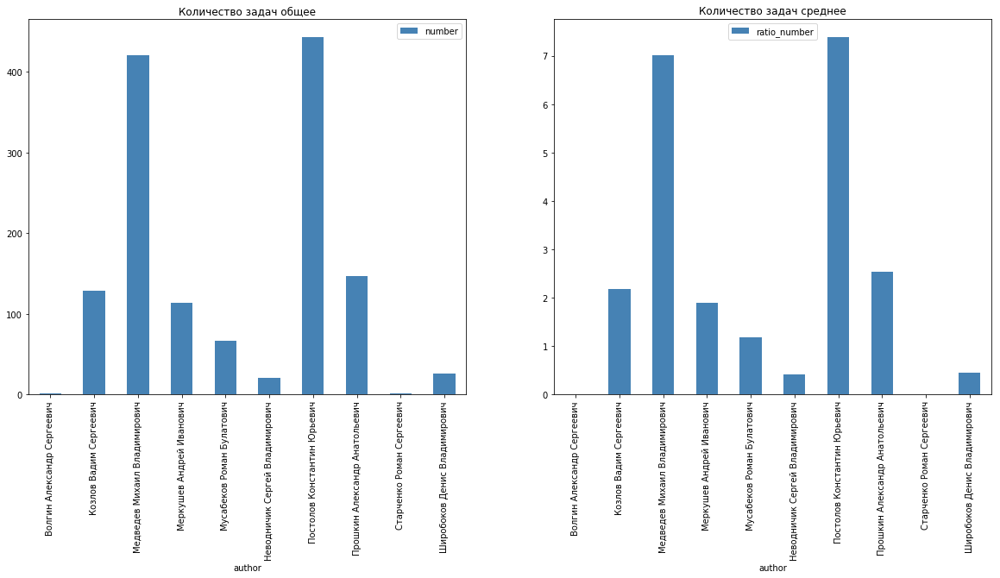

### Общая выработка по периодам месяц - все архитекторы.

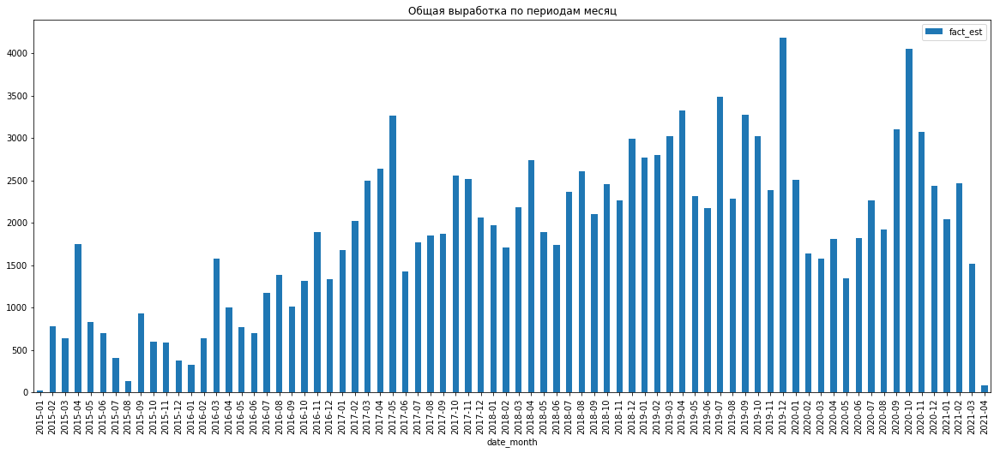

### Выработка по Меркушев, Неводничик
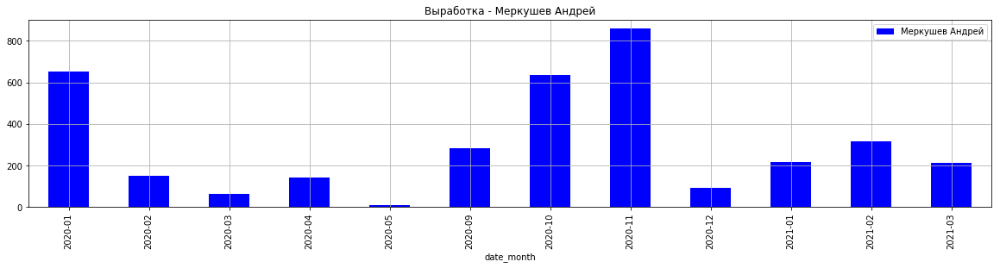
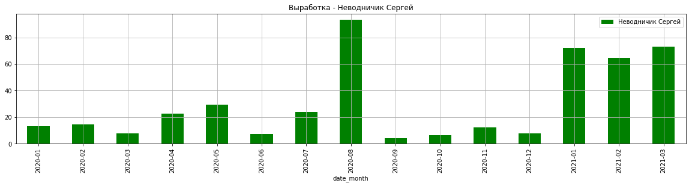


### Распределение плановой оценки по сегментам - до 8ч, от 8 до 16, более 16ч в разрезе проектов. C 01.01.2021.

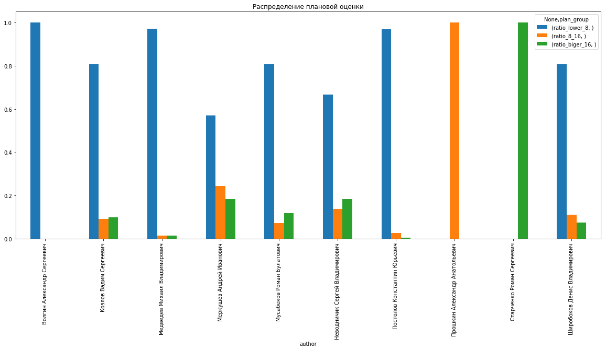


### Задачи с средними фактическими затратами > 20

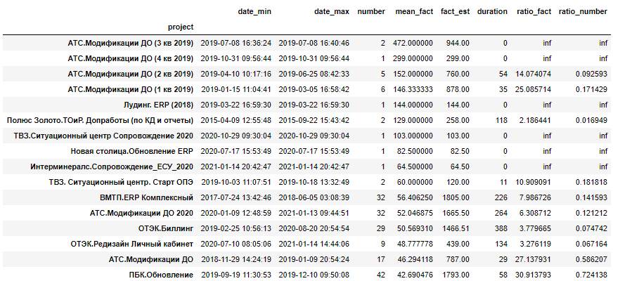

### Отклонения от плановой оценки с 01.01.2021.

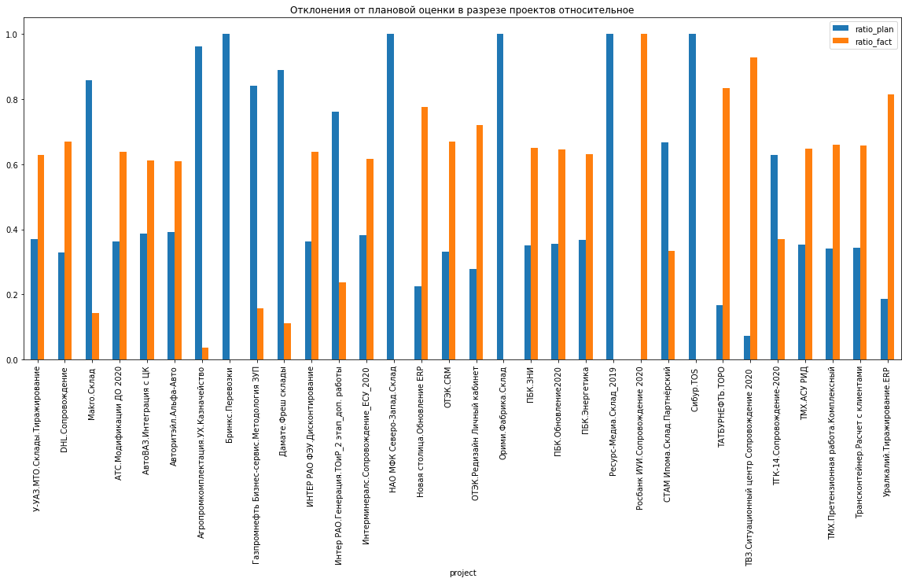

### Отклонение от плановой оценки - Эффективные часы за период с C 01.01.2021.

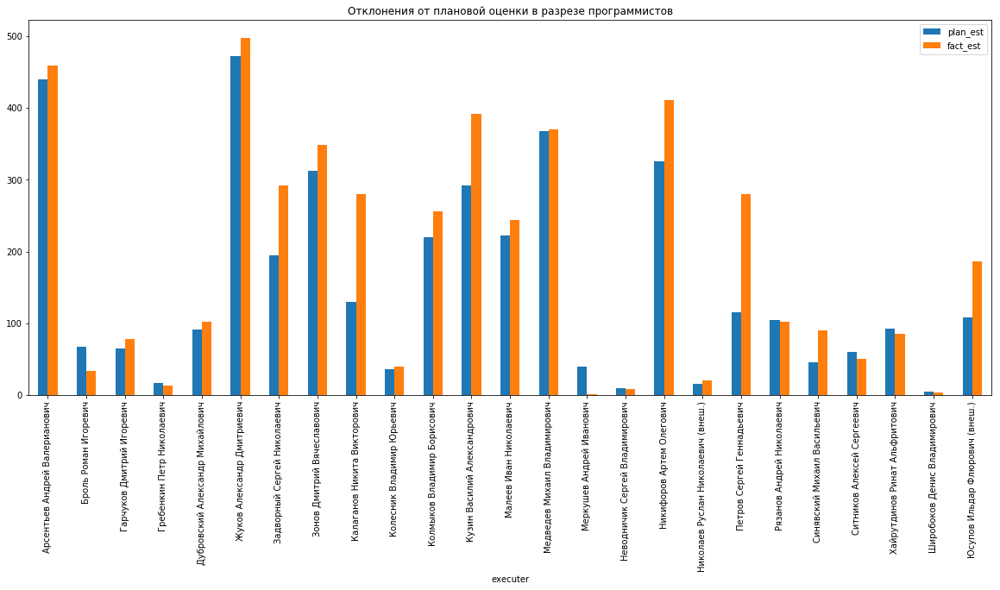

### Отклонение от плановой оценки Калаганов
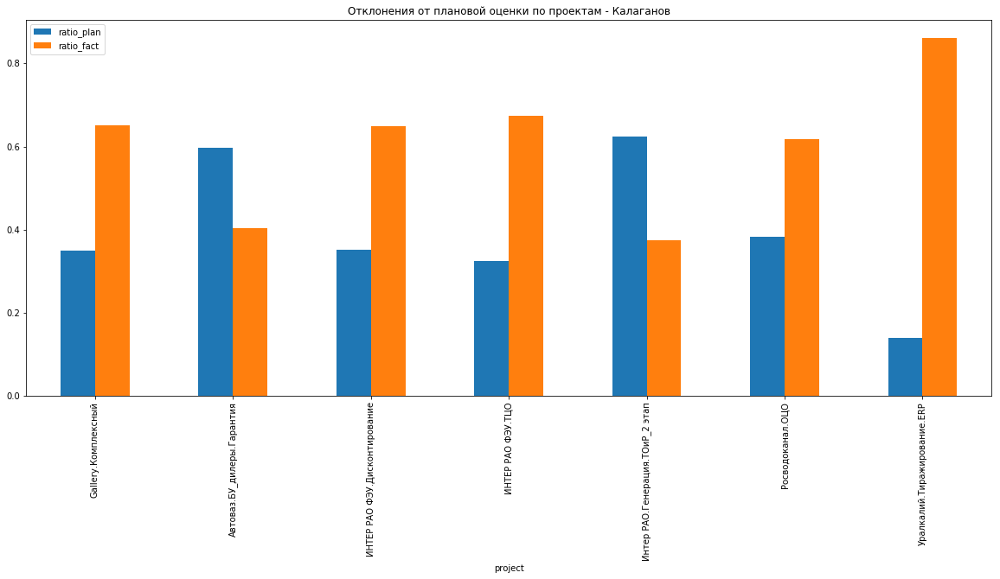

На проекте Уралкалий тироживароине ERP время списано на одну задачу.

### Возвраты на доработку в разрезе программистов с поргом > 0.3

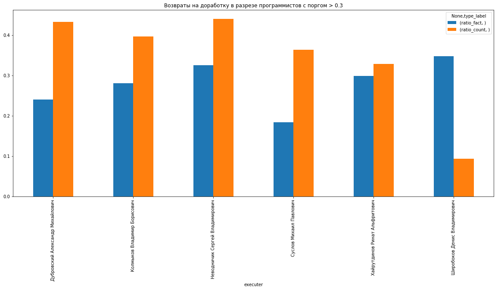


## Пример анализа программистов

* Проект Инград

#### Превышение плановой оценки ()

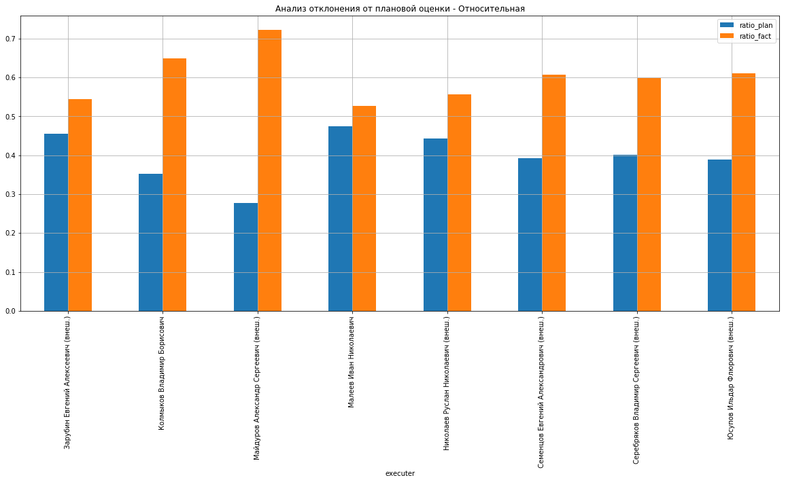

#### Превышение плановой оценки


#### Эффективные  часы

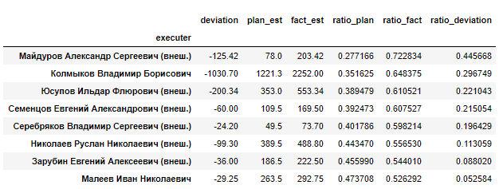

#### Возвраты на доработку


#### Возвраты на доработку Колмыков по периодам

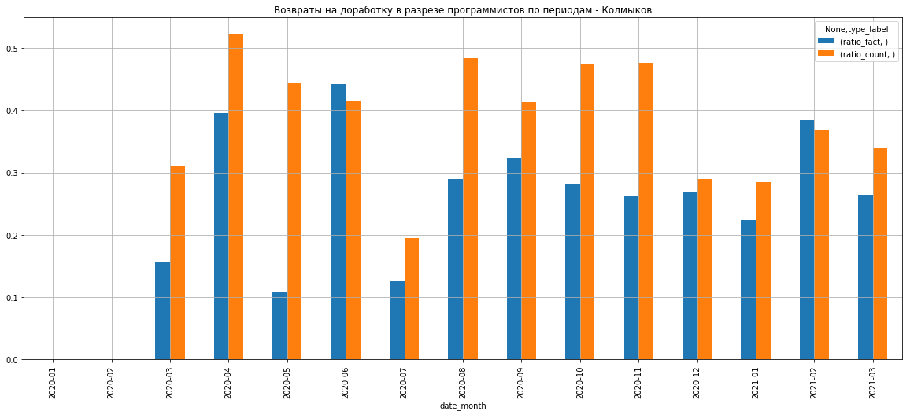


```python

```

#### Показатели, которые на данный момент нет возможности собрать:
* **Объем изменений старого кода.** - `Для выявления частых изменений по задаче, например, при большом значении показателя можно сделать вывод, что разработчик не продумывает задачи.`
>
>> **Ценность:**        Низкий
>>
>> **Сложность сбора:** Высокая
>>
>> **Статус:** Отложено.
>
* **Распределение количества строк кода по задачам.** - `Сравнивая распределения между разработчиками можно определить неэффективных разработчиков с точки зрения написания кода.`
>
>> **Ценность:**        Средний
>>
>> **Сложность сбора:** Высокая
>>
>> **Статус:** Отложено.
>
* **Подробная классификация ошибок.** - `Позволит избегать ситуаций "У вас все не работет"`
>
>> **Ценность:**        Высокая
>>
>> **Сложность сбора:** Средний
>>
>> **Статус:** Отложено.
>
* **Количество нарушений стандартов и правил разработки за период.** - `определить неэффективных разработчиков с точки зрения написания кода.` 
>
>> **Ценность:**        Высокий
>>
>> **Сложность сбора:** Средний
>>
>> **Статус:** Отложено.
>

* **Индекс технического долга.** - `определить неэффективных разработчиков с точки зрения написания кода.`
>> **Ценность:**        Высокий
>>
>> **Сложность сбора:** Средний
>>
>> **Статус:** Отложено.


#### Замечания к данным:
* Нет доступа ко всем задачам разработки.
* Не все архитекторы корректно ведут учет задач в Axelot ERP.
* По некоторым проектам учет задач в Axelot ERP не ведется.

#### Что планируется сделать:
* Внедрить единую методику учета задач на всех проектах.
* Для оценки показателей, связанных с технически долгом и программным кодм планируется  развернуть площадку для автоматизированного контроля кода и репозиторий GIT.
* Разработать ТЗ на разработку отчетов в Axelot ERP - под вопросом.


```python

```
